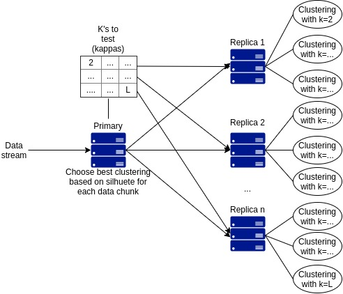

# CluSopt

A Data stream clusterer and hyper parameter optimizer using microservices.



## Prerequisites

* python >= 3.6
* pip
* boost-thread
* docker [optional]

## Installing

Install all dependecies described in `requirements.txt` using pip.

```bash
pip3 install -r requirements.txt
```

To use docker just use the `dockerfile`
```bash
docker build -t clusopt .
docker run -it -p 3523:3523 clusopt bash
```

## Usage
cd to the src directory if not already

```bash
cd src
```

to run primary node
```bash
./primary.py [ALGORITHM] [PATH OR URL TO CSV FILE]
```

NOTE: CSV File must be `,` separated, `\n` line ended and **must not have a header**.

to run replica node
```bash
./replica [IP ADDRESS TO THE PRIMARY NODE]
```

use `-h` and `[ALGORITHM] -h` in both primary and replica for more help

## Published Works

<a id="1">[1]</a> 
G. O. MACEDO and J. A. SILVA and D. M. L. FILHO. (2020). 
UM MODELO DE INFRAESTRUTURA DE MICROSSERVIÇOS PARA ALGORITMOS DE AGRUPAMENTO DE FLUXOS CONTÍNUOS DE DADOS.
SODEBRAS Journal, 15(178), 48-52.
https://doi.org/10.29367%2Fissn.1809-3957.15.2020.178.48

## Authors
* **Giuliano Oliveira de Macedo** - *Coder* [giuliano-oliveira](https://github.com/giuliano-oliveira)
* **Jonathan Andrade Silva** - *Advisor*
* **Dionisio Leite Machado Filho** - *Advisor*

## Acknowledgments

#### Thanks to:

* **Dionisio** for all the the tips to solve all the networking/cloud/virtualization related problems.
* **Jonathan** to all stream clustering/clustering in general /clustering evaluation information used to build this system.
* **Marcel R. Ackermann et al.** for the StreamKM++ algorithm - [link](https://cs.uni-paderborn.de/cuk/forschung/abgeschlossene-projekte/dfg-schwerpunktprogramm-1307/streamkm/)
* **The university of Waikato** for the MOA framework - [link](https://moa.cms.waikato.ac.nz/)